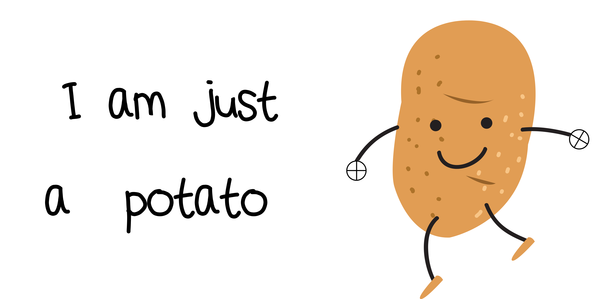

# I am Just a Potato


## Link to the Question

[Click here](https://i-am-a-potato.netlify.app/)

## Answer

```
flag{THEUSERNAMEISPASSWORD}
```

## Solution

As cryptic the question may look, if you give a keen eye on the questions all your answer lie here itself. In the second line `Single potato with single potato ==0` must remind you some equation you've read before, something like `A XOR A = 0`( Remember this?!). hence this gives a clever indication that this is a question of `XOR Cipher`.

Not just that! Potato never hides any lies. Another hint lies `in the hands of potato`, see the tiny logo of XOR? ⊕



So now google a good XOR decoder. Enter the Code but ughhhh... what would be the key to unlock? Ofcourse `POTATO` is the answer to all questions. SO enter #POTATO in the key field (ASCII Key Field)

As Potato is an ASCII key,the decoder should also be of the Type `ASCII PRINTABLE CHARACTER` so get a valid output.


This will get you the desired answer. Enclose the decrypted code in flag{} and Hurray! you've found your flag.

