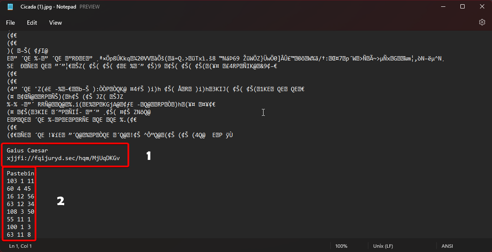
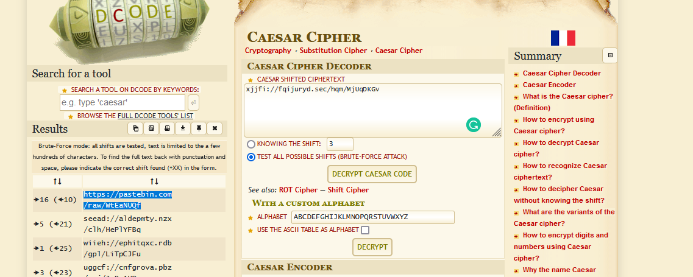
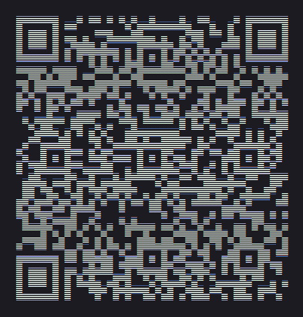

# Bzzzz
## Link to the Question
[Click Here](https://ctf-3301.herokuapp.com/)

## Answer
```
flag{b3w4r3}
```

## Solution
The only thing on the homepage is an image.

Download the image and open it in a text editor.



Here you get 2 clues.

For the first one, it Gaius Caesar with an obfuscated string which looks like a link

This suggests that `caesar cipher` is used. Go to `https://www.dcode.fr/caesar-cipher` and bruteforce the string



Here you get a pastebin link in which there appears to be random text.

On zooming out you can see that the text is a `QR code`



This QR links to the PDF of a book.

[Book Link](https://img1.wsimg.com/blobby/go/528fd387-72f1-4bf6-b4be-2f0e210ec8fc/Ikigai%20_%20the%20Japanese%20secret%20to%20a%20long%20and%20hap.pdf)

Looking at the second clue you got in the initial image, try using the three numbers in each line as `page number, line number, character number`

Doing this you get
``` 
h06TjSRH
```

Since the clue in the text editor tells you to use pastebin, use the key you got from the book as a pastebin link

Going to `https://pastebin.com/raw/h06TjSRH` we get the flag
`flag{b3w4r3}`