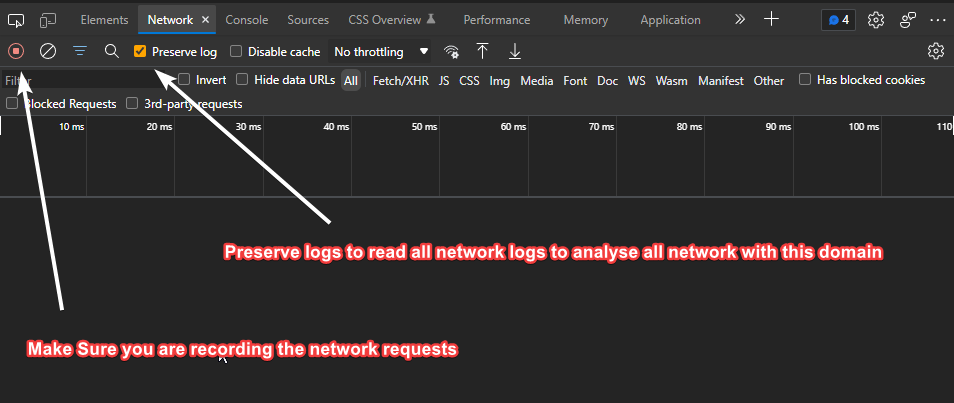
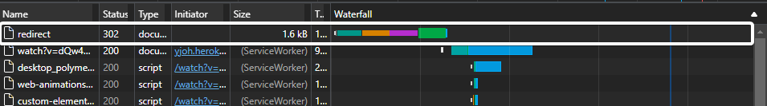
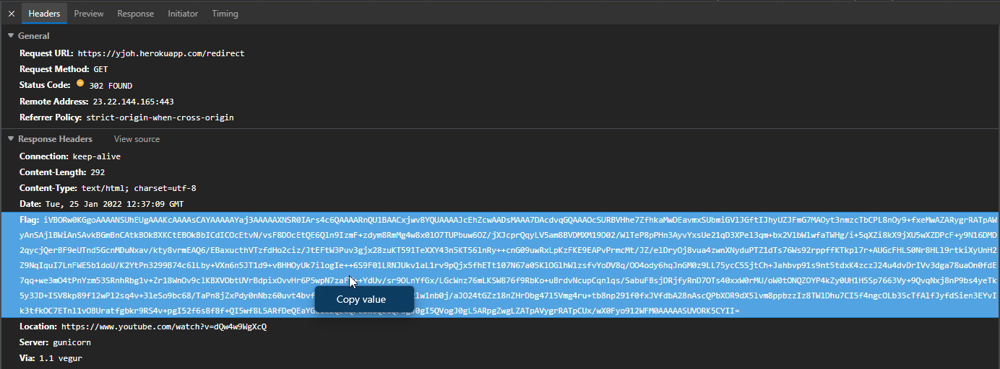
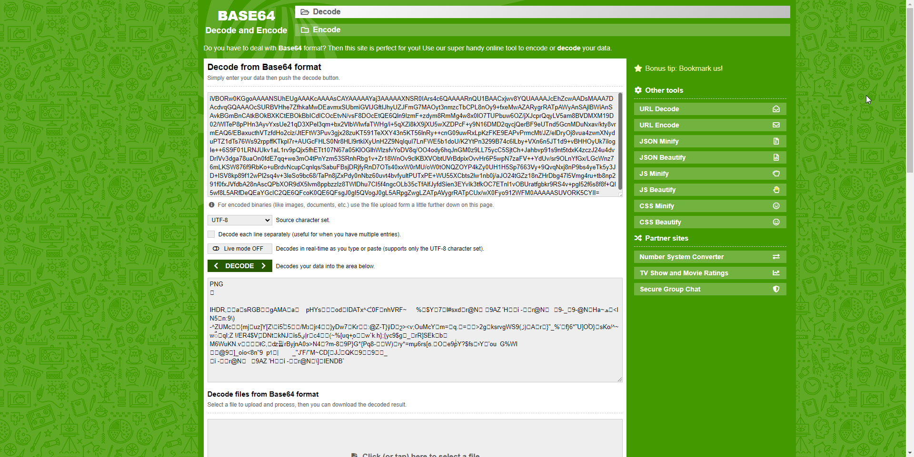
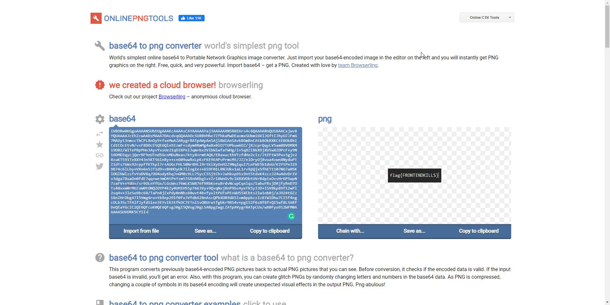

# Simple - Web Exploitation
## Link to the Question
[Click here](https://yjoh.herokuapp.com/)

## Answer
```
flag{FRONTENDKILLS}
```

## Solution
The index page is a simple web page that contains a button that sends you to a `/redirect` and then it redirects you to the [YouTube](https://www.youtube.com/watch?v=dQw4w9WgXcQ).

Open DevTools and click on the `Network` tab. and click the `Click Me` button.
  


Analyze all request from the question domain




When you take a look at the `\redirect` request, you will find that there is a `Flag` header.
And the `Flag` header is 
```text
iVBORw0KGgoAAAANSUhEUgAAAKcAAAAsCAYAAAAAYaj3AAAAAXNSR0IArs4c6QAAAARnQU1BAACxjwv8YQUAAAAJcEhZcwAADsMAAA7DAcdvqGQAAAOcSURBVHhe7ZfhkaMwDEavmxSUbmiGVlJGftIJhyUZJFmG7MAOyt3nmzcTbCPL8nOy9+fxeMwAZARygrRATpAWyAnSAjlBWiAnSAvkBGmBnCAtkBOkBXKCtEBOkBbICdICOcEtvN/vsF8DOcEtQE6Qln9IzmF+zdym8RmMg4w8x0lO7TUPbuw6OZ/jXJcprQqyLV5am8BVDMXM19D02/WlTeP8pPHn3AyvYxsUe21qD3XPel3qm+bx2VlbWlwfaTWHg/i+5qXZi8kX9jXU5wXZDPcF+y9N16DMD2qycjQerBF9eUTnd5GcnMDuNxav/kty8vrmEAQ6/EBaxucthVTzfdHo2ciz/JtEFtW3Puv3gjx28zuKT591TeXXY43n5KT56lnRy++cnG09uwRxLpKzFKE9EAPvPrmcMt/JZ/elDryOj8vua4zwnXNyduPTZ1dTs76Ws92rppffKTkpl7r+AUGcFHLS0Nr8HLl9rtkiXyUnH2Z9NqIquI7LnFWE5b1doU/K2YtPn3299B74c6lLby+VXn6n5JT1d9+vBHHOyUk7ilogIe++6S9F01LRNJUkv1aL1rv9pQjx5fhETt107N67a05KlOGlhWlzsfvYoDV8q/OO4ody6hqJnGM0z9LL75ycC5SjtCh+Jahbvp91s9nt5tdxK4zczJ24u4dvDrIVv3dga78uaOn0fdE7qq+we3mO4tPnYzm53SRnhRbg1v+Zr18WnOv9clKBXVObtUVrBdpixOvvHr6P5wpN7zaFV++YdUv/sr9OLnYfGx/LGcWnz76mLKSW876f9RbKo+uBrdvNcupCqnlqs/SabuFBsjDRjfyRnD7OTs40xxW0rMU/oW0tONQZOYP4kZy0UH1H5Sp7663Vy+9QvqNxj8nP9bs4yeTk5y3JD+ISV8kp89f12wPl2sq4v+3leSo9bc68/TaPn8jZxPdy0nNbz60uvt4bvfyultPUTxPE+WU55XCbts2lw1nb0j/aJO24tGZz18nZHrDbg47l5Vmg4ru+tb8np291f0fxJVfdbA28nAscQPbXOR9dX5lvm8ppbzzIz8TWlDhu7CI5f4ngcOLb35cTfAlfJyfdSien3EYvIk3tfkOC7ETnl1vOBUratfgbkr9RS4v+pgI52f6s8f8f+QI5wf8L5ARfDeQEaYGcIC2QE6QFcoK0QE6QFsgJ0gI5QVogJ0gL5ARpgZwgLZATpAVygrRATpCUx/wX0Fyo912WFM0AAAAASUVORK5CYII=
```
First thing to come in your mind is that the after take a look at this pretty long `Flag` header which also ends with `=` as well, is try base64 decoder.

After decoding via a online base64 decoder


As you can see its starts with `PNG`. So it is a base64 encoded png image.
Try to decode it via online base64 image decoder.


And by doing so, you can see that the flag is `flag{FRONTENDKILLS}`.
