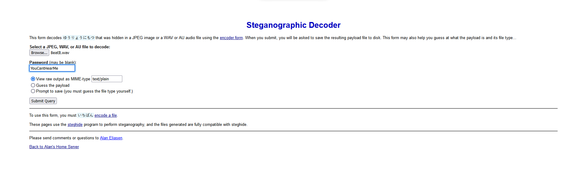
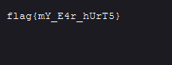

# King of Pop (?)
## Link to the Question
[Song.wav](http://iiitv-ctf.ml/ctf/BeatIt.wav)

## Answer
```
flag{mY_E4r_hUrT5}
```

## Solution
On hearing the song you notice that the beat is only playing in one ear and there is a noise in the background

Open the song in Audacity and check the `spectrogram`


Use this password to decrypt the `steganographic cipher` on the song (wav and au formats are the only ones supported by steganography)

Go to `https://futureboy.us/stegano/decinput.html` and paste the password with raw output or you can use steghide



This gives you the flag


