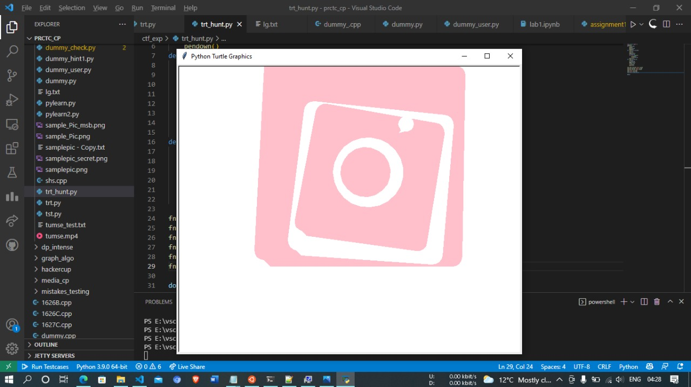

# DD2D
## Link to the Question
[Click here](https://gist.github.com/vidit2512/ef5e26f50a9516f06c429df831148ef9)

## Answer
```
flag{instagram}
```

## Solution
The text is decrypted in ```Base64``` format.
After encrypting it, we will find a python code.
While exectuing it, we will obtain an image.



By obversing the image we can easily conclude it is of instgram.
So, the flag will be ```flag{instagram}```.