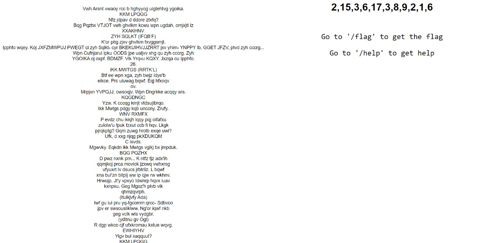
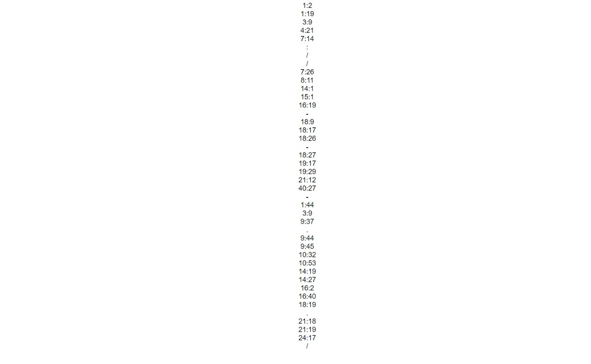
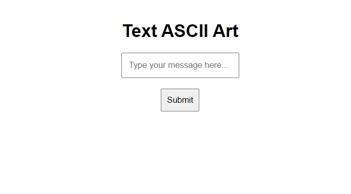

# Anton
## Link to the Question
[Click here](https://ctf-oct-gbl.herokuapp.com/)

## Answer
```
flag{insert_cool_flag_here}
```

## Solution
The website has 2 endpoints `/flag` and `/help`, with some encrypted text on the homepage:

  


Send a GET request to the following URL:  
```
https://ctf-oct-gbl.herokuapp.com/flag
```  

You will get a response that you can't access the flag directly.

Open reqbin and send a GET request to the same URL:

```
https://ctf-oct-gbl.herokuapp.com/flag
```

You will get a response that only `Son of Anton` can access the flag.

This is because the `/flag` route has been restricted only to be accessed by `Son of Anton`.

Now if you see the encrypted text and look at the numbers, you may observe a pattern.

```
V - 2 = T
w - 15 = h
h - 3 = e
  6 (ignore) = whitespace
A - 17 = J
r - 3 = o
s - 8 = k
n - 9 = e
t - 2 = r
  1 = whitespace
v - 6 = p
w - 2 = u
a - 15 = l
o - 3 = l
y - 6 = s
```
NOTE: Ignore the symbols in the same way that we ignored whitespace.

We need to decrypt this cipher in order to get the plaintext.

We can write a python script to do so.
```py
text = """Vwh Arsnt vwaoy rcc b hghyyog uigtehtvg ygoika.
KKM LPQGG
Nfz jdpav d ddore ztxfq?
Bqg Pqzhx VTJOT vwh ghvlkm kcwu wpn ugdah, omjxjti lz
XXAKHNV.
ZYH SQLKT (IFQB’F)
K'or pitg zjxv ghvlkm fxvggsmjt.
Ipphfo wqey. Koj JXFZMWPUJ PWEGT ci zyh Sqlkt- cyr BKEKUIHVJJZRRT jxv yhim- YNPPY lb, GGET JFZV, ptvd zyh cccrg...
Wpn Cufnjarul ipku OODS jpe ualjvv xhg qu zyh cccrg. Zyh
YGOIKA oj oxpf. BDMZF. Vik Yrqvu KQXY. Jxzqa cu Ipphfo.
26.
IKK MWTGS (RRTK’L)
Btf ee wpn xga, zyh bwjz ldye'b
eikce. Prc uiuwag bqwf. Eqj hfxoqv
ov.
Mrpjxn YVPQJJ, owsoqjv. Wpn Dngrkke acqqy wls.
KQGDNGC
Yzw. K cccqg kmjt vtdsujlbrqo.
Ikk Mwtgs pdgy kqb unccny. Zrufy.
WNV RXMFX
P evdz chu ikkjh lqqy pqj oifafxu
zulolw'u fpuk fzxut ccb fi hqv. Lkgk
pjrqkptg? Gqm zuwg hrotb exqe uwi?
Ufk, d xxg njqg pkXDUKQM
C ixvds.
Mgwvky. Eqkdn ikk Mwtgs vglkj bx jmpduk.
BQG PQZHX
D pwz nxnk pm... K ntfz fjz adx'ih
qqmjkcj prca moviok jzxwq vwhxrsg
ufyuxrt lv dsucs jrbtriiz. L bqwf
xna bul'zn bltplj ww ip qjw rw wkhnv.
Hrwujp. Jt'y vpxyo Idwnrp hqvx iuav
kxnpxu. Geg Mgoz'h plvb vik
qhmzqvrph.
(ltulkjvfy Ada)
Iwf gu iui pru yq-fgcomm qrcc- Sdbvco
jpv er swsousliklww. Ng'or iqwf nkb
geg vclk wls vydgbr.
(ydltnu gv Ogl)
R dgp wkco cjf ufxkromau kxtue wqvg.
EWHIYHV
Yigv bul xaqquut?
KKM LPQGG
Ok'a ujsrah. Nqun zjt Hrwujp."""

def decrypt(text,s):
    if (char.isupper()): return chr((ord(char) + s-65) % 26 + 65)
    else: return chr((ord(char) + s - 97) % 26 + 97)

order = [2,15,3,6,17,3,8,9,2,1,6]
string = ""
i=0

for char in text:
    if char.isalpha():
        string+=decrypt(char,26-order[i%11])
    else:
        string+=char
    i+=1
print(string)
```
This will give us the plaintext

Now if we navigate to `/help`, we will see some numbers and symbols which seem to form a URL.


The numbers here are in the format of line:character, that means if the first line is 1:2 then we have to take the second character from the first line.
To do so we can again write a python script:
```py 
text = """The Joker pulls out a freshly sharpened pencil.
THE JOKER
How about a magic trick?
The Joker SLAMS the pencil into the table, leaving it
UPRIGHT.
THE JOKER (CONT’D)
I'll make this pencil disappear.
Gambol nods. His BODYGUARD MOVES at the Joker- who SIDESTEPSGRIPS his head- SLAMS it, FACE DOWN, onto the table...
The Bodyguard goes LIMP and slides off of the table. The
PENCIL is gone. MAGIC. The Joker BOWS. Grins at Gambol.
26.
THE JOKER (CONT’D)
And by the way, the suit wasn't
cheap. You should know. You bought
it.
Gambol STANDS, furious. The Chechen stops him.
CHECHEN
Sit. I wanna hear proposition.
The Joker nods his thanks. Rises.
THE JOKER
A year ago these cops and lawyers
wouldn't dare cross any of you. What
happened? Did your balls drop off?
See, a guy like meGAMBOL
A freak.
Laughs. Which the Joker tries to ignore.
THE JOKER
A guy like me... I know why you're
holding your little group therapy
session in broad daylight. I know
why you're afraid to go out at night.
Batman. He's shown Gotham your true
colors. And Dent's just the
beginning.
(indicates Lau)
And as for his so-called plan- Batman
has no jurisdiction. He'll find him
and make him squeal.
(smiles at Lau)
I can tell the squealers every time.
CHECHEN
What you propose?
THE JOKER
It's simple. Kill the Batman.
""".split("\n")

order = """1:2
1:19
3:9
4:21
7:14
:
/
/
7:26
8:11
14:1
15:1
16:19
-
18:9
18:17
18:26
-
18:27
19:17
19:29
21:12
40:27
-
1:44
3:9
9:37
.
9:44
9:45
10:32
10:53
14:19
14:27
16:2
16:40
18:19
.
21:18
21:19
24:17
/
""".split("\n")

string = ''

for i in order:
    if ":" in i and len(i)>1:
        n, m = [int(a) for a in i.split(":")]
        string+=text[n-1][m-1]
    else:
        string+=i
print(string)
```
This will give us a URL:
```https://ascii-art-iiitv-ctf.herokuapp.com/```

Opening this URL will give us a form as shown in the picture below:


If you noticed the title, it says `Son of Anton`.

if we enter any string inside that input box and click on submit it will display it's ASCII art.

Now let's try to check if some certain characters are blocked. This might give us an idea of how the ASCII art is generated and whether it is vulnerable.

If we enter ``1234567890-`[];',./`` in the input box, we will get this output:
```json
{"success":false,"error":{"killed":false,"code":2,"signal":null,"cmd":"node routes/figlet.js 1234567890-`[];',./"}}
```
Now we can see that the server is generating the ASCII art by executing a local file and parsing the command line arguments.
in this case the command is ``node routes/figlet.js 1234567890-`[];',./``.

This means the server is vulnerable to a command line injection attack.

Now since we know that only Son of Anton can access the flag, we can try to inject a `curl` command by submitting the following query:
```hi && curl https://ctf-oct-gbl.herokuapp.com/flag```

This will give us an output which contains the flag:
```flag{insert_cool_flag_here}```