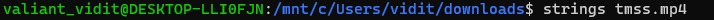
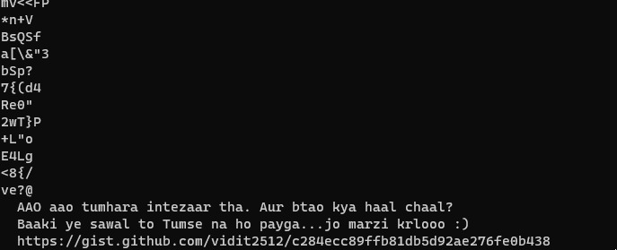
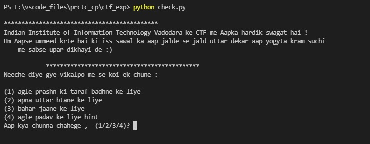
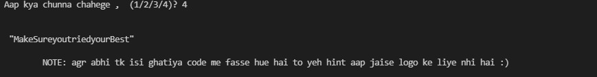
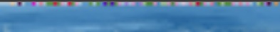
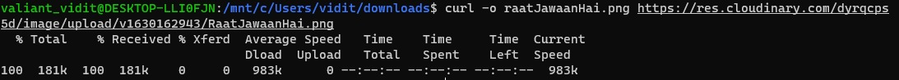
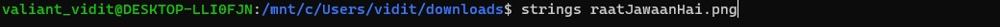
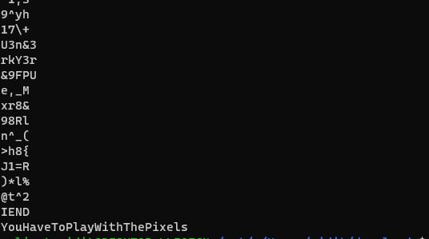

# Karpaoge?
## Link to the Question
[Click Here](https://res.cloudinary.com/do4r9y83o/video/upload/v1635513364/tumse_na_hopayega_wksaqi.mp4)

## Answer
```
flag{heY_i_guesS_borE_tO_nhI_huE_hogE!}
```
## Solution
### Step 1 : Extracting data from video
Firstly, after dowloading the video. You can use ```strings``` command which will find a [url](https://gist.github.com/vidit2512/c284ecc89ffb81db5d92ae276fe0b438) embeded in the video.






### Step 2 : Decrypting the text from github gist
After viewing the gist url, you can see a text encrypted in ```Base64``` format.
The text can easily be decoded which will give you a python code.

### Step 3: Interacting with the code
It is a interactive code which will demand you to enter the input and will give the output as being programmed.



### Step 4: Reverse engineering the code
While reverse engineering the code, a key will be discovered which will be in the form of a [link](https://res.cloudinary.com/dyrqcps5d/image/upload/v1630162943/RaatJawaanHai.png), redirecting you to an image.

#### NOTE: In this code, you are also provided with an additional hint for next level in the question, that is option 4 in the interactive code.



Here, the hint is decoded as ```MakeSureyouTriedyourBest```, let's see how you can decode it and keep it for later use.

### Step 5: Analysing the image
After visiting the link, we will get an image.


If we zoom in the image and try to observe something, we will notice something unusual at the top left corner side of image,i.e., the pixels of that side is not uniform.



Now Let's try ```curl -o <image_name> <link>``` command to download the image.



After downloading use ```strings``` command to find if there is any hint in the image.





So from here we discovered a hint which is ```YouHaveToPlayWithThePixels```.
Now, till now from the previous hint and last observation we are able to know that there is something to do with the pixels of the image.

Now, let's try to decode the hint we got from the previous py code, i.e., ```MakeSureyouTriedyourBest```.
here, if we focus on the capital letters, we will notice ```MSB```.

So there exists a MSB Stegnography technique, in which the message is hidden in the maximum significant bit(MSB)pixels of the image.

So now, let's try to write a python code, in which we will take image as an input, will read its pixels,will convert them into binary and then extract the maximum significant bit(MSB) of each pixel and later will combine them which will later be decoded in ascii to give us the flag. 

Here, one thing to make sure is that the png image is of the form ```RGBA```, so while reading the image and converting it into a 1D array from 2D array, we will consider width\*height\*4, if let's say the image was of the form ```RGB```, we will consider width\*height\*3 and later that would also effect our MSB position, as in our case, the MSB of the pixel would be at 8th position, where as in case of ```RGB```, it would be at the 6th position.

```
from PIL import Image
import numpy as np
with Image.open("raatJawaanHai.png") as img:
    width, height = img.size
    data = np.array(img)
    
data = np.reshape(data, width*height*4)
# extract MSB of each pixel
data = data & (1<<7)
data=data>>7 
# Packs binary-valued array into 8-bits array.
data = np.packbits(data)
# Read and convert integer to Unicode characters until hitting a non-printable character
for x in data:
    l = chr(x)
    if not l.isprintable():
        break
    print(l, end='')
```


Which will give us the flag.


Voila, we found the flag :\) i.e., ```flag{heY_i_guesS_borE_tO_nhI_huE_hogE!}```.