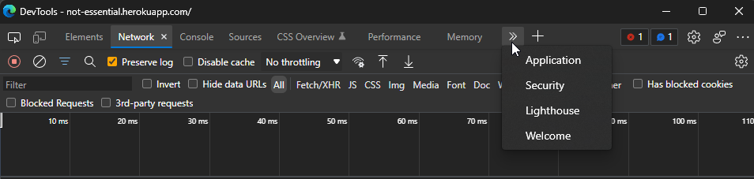
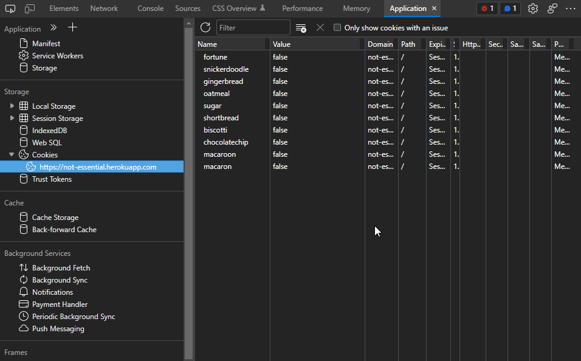
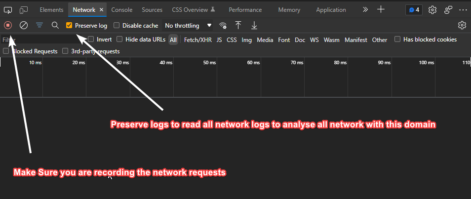
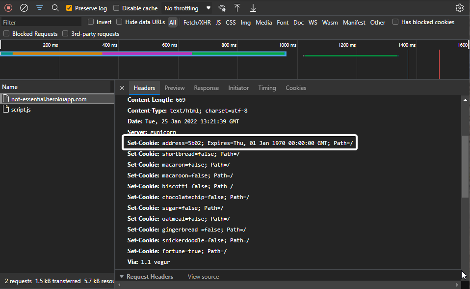
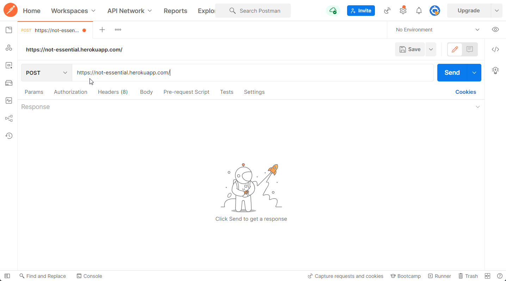
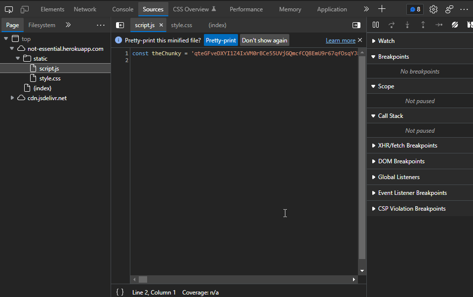

# Fortune - Web Exploitation

## Link to the Question

[Click here](https://not-essential.herokuapp.com/)

## Instructions

- Enter flag in `flag{ ___ }` format

## Answer

```
flag{tzMTyVivZ6}
```

## Solution

The index page says `Can you send me fortune cookie? :please:`

So, we check sites cookies first. Go to DevTools and click Application tab.



Then, click Network tab. and check cookies.



We can see that there is a cookie named `fortune`. Set its value to `true` from `false`. Then, click Reload the page.

And we get response

```text
You can't send cookie like that, you need to post it to my address
Sometimes people send me expire cookies and that make me :cry:
```

Here, you can see that we get hint that we need to send post request to address and something about expire cookies.

Open DevTools and click on the `Network` tab.



And refresh the page, check the response headers.



Here we got the address `5b02`
`NOTE: we can't see this cookie like  we normally do. cause this cookie expiry date is 01 Jan 1970, so it will not be saved.`

Now we know we have to send post request to `/5b02` with `fortune=true` as cookie

Open [Postman](https://www.postman.com/) and send post request to `/5b02` with `fortune=true` as cookie



We get response

```text
Hey, I found this inside fortune cookie
\{(?<flag>[^regular{,}]{10,}?)\}
```

`\{(?<flag>[^regular{,}]{10,}?)\}` is the regular expression to get the flag.

We also find there is a script.js in sources. Now search in script.js with regular expression.



And we get `{tzMTyVivZ6}`

Now we wrap `{tzMTyVivZ6}` with flag as in instructions.

So Flag is `flag{tzMTyVivZ6}`