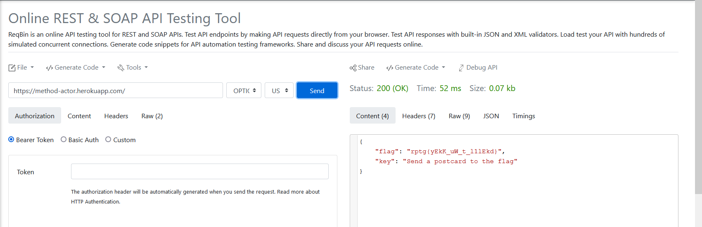
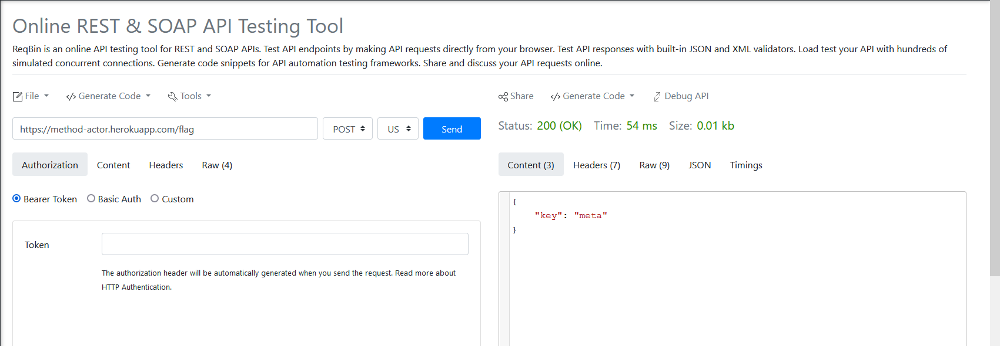

# Re(Quest)

## Link to the Question
[Click Here](https://method-actor.herokuapp.com/)

## Answer
```
flag{mArK_iS_a_l1zArd}
```

## Solution
The index page says `If you REQUEST politely, I might think about that OPTION`

Open reqbin and send an OPTION request to the question's url.



With this you get an encrypted flag with a clue for the key
```
flag = rptg{yEkK_uW_t_l1lEkd}
```

Now from reqbin send a POST request to `/flag`



```
key = meta
```

You can try some basic ciphers to decrypt the flag which require a key to decipher
or try checking `/help` endpoint where we find that the flag is encrypted with vigenere cipher

Go to dcode.fr or any other cryptography site and decipher the vigenere cipher with the key


This will give us an output which contains the flag:
```flag{mArK_iS_a_l1zArd}```
