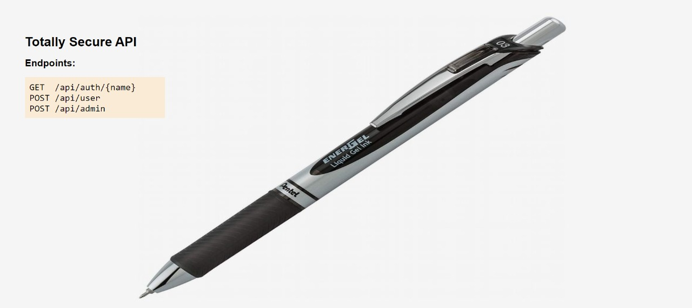
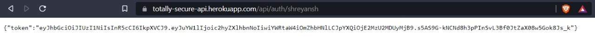
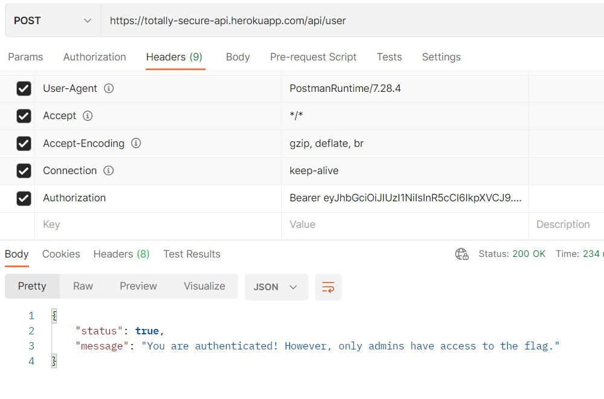
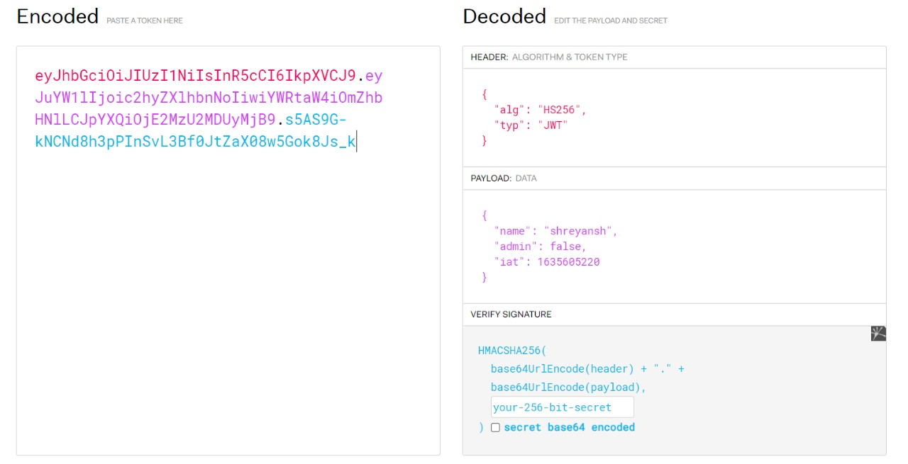

# Identity Theft (JWT)
## Link to the Question
[Click here](https://totally-secure-api.herokuapp.com/)

## Answer
```
flag{jwt_is_awesome}
```

## Solution
The website has 3 endpoints:

  


Send a GET request to the following URL :  
```
https://totally-secure-api.herokuapp.com/api/auth/shreyansh
```
(you can enter any name of your choice)  

You will get a token in the response.



Open Postman and send a POST request to the following URL with the token in the Authorization header:

```
https://totally-secure-api.herokuapp.com/api/user
```



It returns a JSON response with the following fields:
```json
{
    "status": "success",
    "message": "You are authenticated! However, only admins have access to the flag."
}
```

Now if you try to hit a POST request on `/api/admin` route you will get the following response:

```json
{
    "status": false,
    "message": "You are not authenticated."
}
```

This means that we somehow need to authenticate the user as an admin.

First let's look how JWT works.

The Token consists of 3 parts. They are `payload`, `signature` and `header`.

1. The `payload` is the data that is being sent to the server. In this case it is the username.

2. The `signature` is the signature of the `payload` and the secret key.

3. The `header` is the metadata of the token. It contains the algorithm used to sign the token and the type of the token.

So if you visit jwt.io and decode the token you will see the following information:



If you notice the payload you will see there's an admin field which is set to `false`. Manipulating that field will not work as the token needs to be signed with a secret key that the server trusts.  

Now if you go back to the homepage you might notice the peculiar background image of a pen, this signfies that you have to pentest the website to discover hidden routes.

A quick google search will lead you to this [website](https://pentest-tools.com/website-vulnerability-scanning/discover-hidden-directories-and-files).  

On running the pentest you will discover a secret route `/hacks`.

Opening the route will give you an audio file of the song "Hey Jude" by the Beatles. The audio file contains the JWT Secret Key which has been hidden using steghide. If you open the console on the webpage you will find `thebeatles` logged in the console.

After running steghide on the file you will obtain the following string.  
```env
JWT_SECRET=you_are_quite_close
```

Now go back to jwt.io, change admin to `true` in the payload section and add the secret you found to the `your-256-bit-secret` field in the Verify Signature section. Doing this will result in a new token that has now been signed with the secret key.  

Now upon sending a POST request to the `api/admin` route with the new Authorization token, you will get the following response:  
```json
{
    "status": "success",
    "flag": "flag{jwt_is_awesome}"
}
```